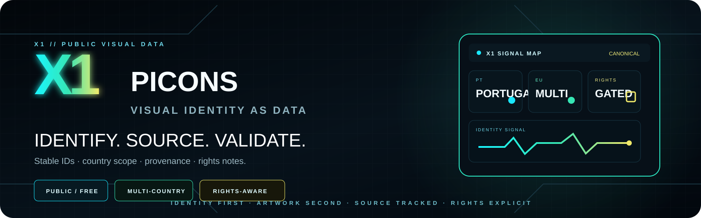
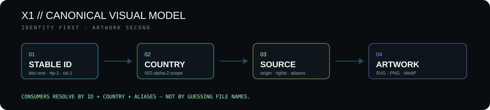
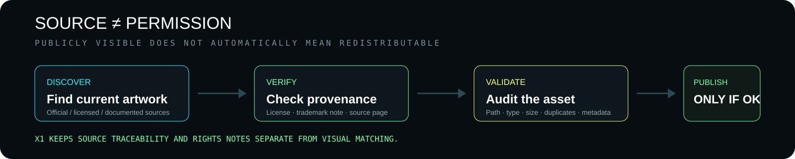

<p align="center">
  
</p>

# X1 Picons

**X1 Picons is the public visual-signal catalogue used across the X1 ecosystem.**

It is built around stable channel identities, country-aware organization, source traceability and explicit rights notes — not around an uncontrolled folder of logo files.

> **Current migration state:** the old root PNG dump has been removed. The repository now uses the structured X1 layout under `countries/`, `categories/`, `sources/`, `data/` and `tools/`.

---

## X1 model

<p align="center">
  
</p>

A picon is not identified by whatever filename happens to exist today.

X1 treats the stable channel identity as the primary key. Artwork can change without forcing consuming applications to change their canonical channel IDs.

Typical identity fields include:

- stable `id`;
- ISO 3166-1 alpha-2 country scope;
- channel name and aliases;
- category;
- canonical target path;
- source URL / source page;
- rights or licensing note;
- trademark note where relevant.

Consumers should resolve assets by **ID + country + aliases**, not by guessing filenames.

---

## Repository structure

```text
picons/
├── countries/       # country-scoped picon library
├── categories/      # category views / organization
├── sources/         # source manifests and provenance metadata
├── data/            # canonical indexes and validation reports
├── tools/           # validation, synchronization and coverage tooling
├── .github/         # automation
├── README.md
├── RUN_SYNC.md
└── migration documentation
```

The legacy root-image layout is no longer the active model.

---

## Countries

The structured catalogue currently includes source/manifests work across multiple markets, including:

**Portugal · Spain · France · Germany · Italy · United Kingdom · Switzerland · Netherlands · Belgium · Brazil**

Additional countries can be introduced without changing the canonical identity model.

Country directories use lower-case ISO-based paths such as:

```text
countries/pt/
countries/es/
countries/fr/
countries/de/
countries/it/
countries/gb/
countries/ch/
countries/nl/
```

---

## Asset rules

Modern X1 picons may use SVG, PNG or WebP when appropriate.

Naming and organization follow these rules:

- lower-case, ASCII-safe slugs;
- no spaces;
- no disposable names such as `copy`, `final2`, `(2)`;
- stable IDs independent of artwork changes;
- country/path consistency;
- transparent assets where appropriate;
- no arbitrary global dimension standard forced on unrelated source artwork;
- source provenance retained in the manifest layer.

Examples:

```text
rtp-1.svg
sic-noticias.svg
la-1.svg
antena-3.svg
france-2.svg
rai-1.svg
bbc-one.svg
sport-tv-1.svg
```

---

## Source and rights gate

<p align="center">
  
</p>

Finding a current logo online does **not** automatically prove redistribution rights.

X1 keeps these questions separate:

**Is this the correct/current artwork?**  
**Can X1 redistribute this asset?**

Source manifests exist so artwork can be audited with its source page, source URL, aliases, status, licensing note and trademark context.

Where redistribution permission is not clear, the correct state is **unresolved / not proven**, not an invented license assumption.

---

## Manifest validation

`tools/audit_manifests.py` validates the structured source manifests before synchronization.

The validation layer is intended to catch issues such as:

- malformed JSON;
- duplicate stable IDs;
- duplicate output paths;
- unsafe paths;
- invalid or unsupported source URLs;
- country/path mismatches;
- alias collisions;
- unsupported payload assumptions.

This keeps identity and provenance errors out of the materialized catalogue.

---

## Canonical metadata

`data/index.json` is designed to be the machine-readable catalogue authority once assets are materialized and validated.

Example model:

```json
{
  "id": "bbc-one",
  "name": "BBC One",
  "country": "GB",
  "category": "general",
  "file": "countries/gb/bbc-one.svg",
  "aliases": ["BBC1", "BBC One HD"]
}
```

**Important:** source manifests existing in Git does not by itself prove that every corresponding asset is already materialized into the current index. Runtime/materialization state must be verified separately.

---

## Synchronization

The synchronization tooling is responsible for auditing manifests, downloading approved source assets, validating payloads, calculating hashes, refreshing catalogue metadata and producing operational reports.

See [`RUN_SYNC.md`](./RUN_SYNC.md) for the operational procedure.

The repository follows a simple evidence rule:

> **Manifest present ≠ asset materialized ≠ consumer verified.**

Each state should be proven independently.

---

## Relationship with X1 EPG

X1 Picons and X1 EPG can share stable canonical channel identities where appropriate.

That gives X1 consumers a clean separation:

```text
CHANNEL ID
   ├── EPG metadata / schedule
   └── PICON visual identity
```

Artwork can evolve without changing guide identity, and EPG source changes do not need to rename visual assets.

[X1 EPG](https://github.com/x1-dotcom/x1epg)

---

## Public project principle

This repository is part of X1's public software work.

The goal is a usable, structured public catalogue — not a deliberately incomplete demo whose missing functionality exists only behind a paid unlock.

At the same time, channel names and logos can be protected by copyright and/or trademark. Public availability is not treated as automatic permission to redistribute.

---

<p align="center">
  <strong>IDENTITY FIRST. ARTWORK SECOND.</strong><br>
  <strong>SOURCE TRACKED. RIGHTS EXPLICIT.</strong><br><br>
  <strong>X1 // VISUAL SIGNAL LIBRARY</strong>
</p>
